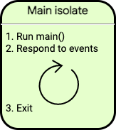
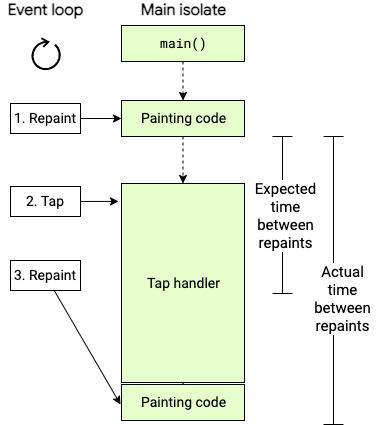
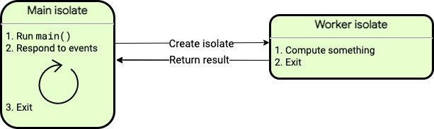

# 비동기 관련 정리

## 일반적인 비동기 처리
Future, async, await을 이용

### Future은 뭔가요
작업이 끝난 후 미래에 설정한 제네릭 값이 올거다 라는 약속

### async, await
CoroutineScope.launch -> async
await -> future 작업 완료를 대기

## async*
async와 동일하게 비동기 함수에 붙는다 다만 `async`가 `Future`를 반환한다면 `async*` 는 `Stream`을 반환한다.

# [Stream](./stream.md)

## isolate
모든 dart코드가 실행되는 곳 

플러터는 단일 스레드로 실행되고 그 스레드는 이벤트 루프를 실행하고 있음
자바나 코틀린의 경우 같은 메모리를 공유하는 다중 스레드를 가질 수 있는데 다트에서는 아님

다트에서는 스레드가 메모리를 가진채로 isolate에 존재

대부분의 다트 앱은 단일 isolate에서 모든 코드를 실행함 하지만 필요하면 늘릴 수 잇음
`Isolate.spawn` or `compute`를 통해서 별도의 isolate를 생성가능

둘 다 개별의 isolate를 만들어서 처리를 진행됨

생성된 isolate는 고유한 이벤트 루프를 가지게됨 따라서 메인에서 생성한(부모가 생성한) isolate일지라도 접근이 불가능함 명칭 그대로 독립적임 

그럼 어떻게 상호작용을 할 수 있는가? 서로 메세지를 보내는 방식으로 협업할 수 있음
메세지를 받으면 이벤트를 사용해서 메세지를 처리함

너무 분리된거 아닌가? 하지만 장점이 있음 단일 스레드만 사용하니 lock이 필요없음

### Dispatcher.Main, IO, Default같은 개념은 없는 걸까
있다 
기본적으로 Dart프로그램은 main isolate에서 실행된다  ==> 안드로이드의 메인 스레드
아래 이미지는 프로그램이 실행이 시작되는 스레드이다

[출처 공홈](https://dart-ko.dev/language/concurrency#isolate-%EC%9E%91%EB%8F%99-%EB%B0%A9%EC%8B%9D)

단일 isolate 프로그램에서도 async-await을 통해 비동기 작업이 완료할 때까지 기다렸다 다음 코드를 진행하면 원활하게 실행 가능

### isolate 생명주기
`main()` 함수 같은 dart 코드를 실행하며 시작됨

isolate에서 실해오딘 Dart 코드가 종료된 후에도 이벤트를 처리해야한다면 isolate는 계속 유지

이벤트의 처리가 끝나면 isolate는 종료

## Event loop
isolate에는 이벤트를 처리하면 이벤트 큐가 있고 이 큐는 FIFO 순서로 큐에 있는 이벤트를 처리
이벤트를 순차적으로 처리하기에 만약 메인 isolate에서 오래걸리는 작업은 안드로이드와 마찬가지로 피해야함 

탭 이후 앱은 반응이없어 멈춰있거나 버벅거리는 현상을 야기한다 더심해지면 반응이 아예 없을 수도 있다

### ANR을 피할 간단한 방법은?
시간이 오래걸리는 작업은 워커 isolate, _백그라운드 워커_ 로 이전하면된다 아래 그림은 계산을 수행하고 종료되는 간단한 워커 isolate를 생성한다 워커 isolate가 종료될 때 계산 결과를 메세지로 반환된다

각 isolate는 메세지를 통해 객체를 전달가능하지만 모든 전달내용이 전달 가능 조건을 만족해야한다 
전달 가능 객체애 대해서는 `send()`메소드 [API 문서](https://api.dart.dev/stable/dart-isolate/SendPort/send.html)를 참고하라고 한다

워커 isolate는 파일을 읽고 쓰는 것과 같은 I/O, 타이머 설정 등을 수행할 수 있습니다. Isolate는 자신만의 메모리를 가지고 있고 main isolate와 상태를 공유하지 않습니다. 워커 isolate를 블락해도 다른 isolate에 영향을 미치지 않습니다.