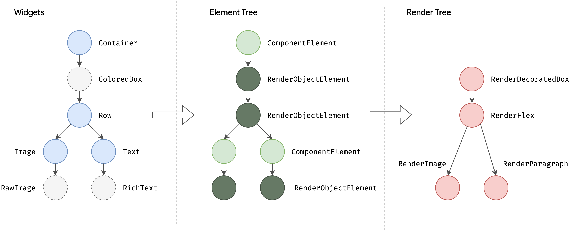
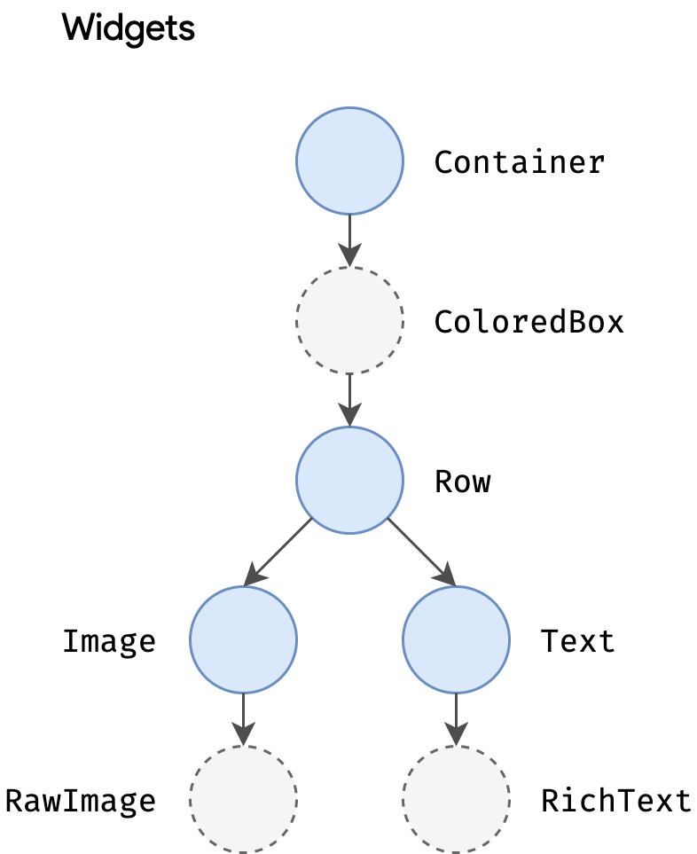
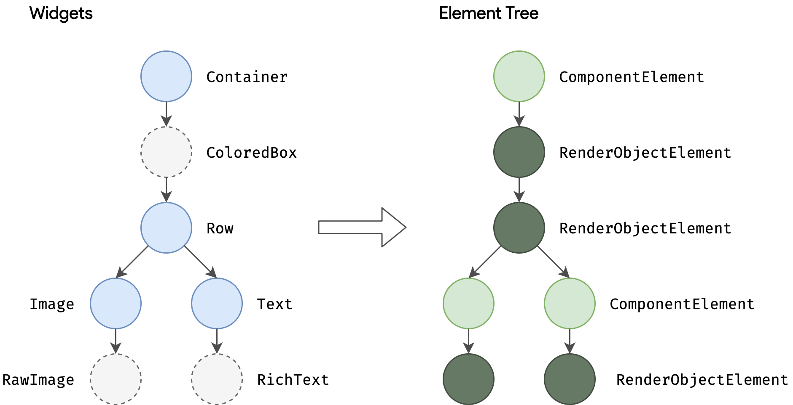
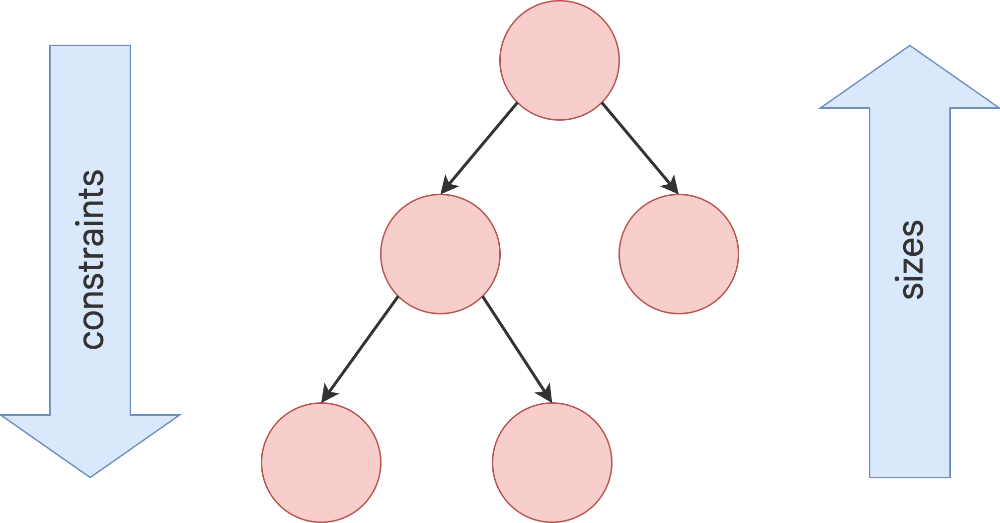

# Flutter Study

## 내가 찾는 위젯이 이미 존재하는지 검색은 어떻게 하는걸까 공식문서에 있으려나
[공식문서](https://docs.flutter.dev/ui/widgets)에서도 애니메이션이나 레이아웃에 대한 소개가 있고

[Flutter Awesome](https://flutterawesome.com/tag/music-player/)처럼 플러터로 만든 각종 UI가 있는 사이트도 있다 요 사이트에서는 gitHub을 통해 코드를 볼 수 있는 것도 있어서 중간중간 막히거나 디자이너가 없는 상태에서 사이드 플젝을할 때 참고해도 좋을 것 같다


## 인터페이스나, abstact 클래스는 어떻게 관리되고 어떻게 활용하면 좋을까
kotlin와 비슷함
다만 다트는 일반 클래스가 상속도, 인터페이스 구현도 가능함.

일반 클래스가 인터페이스의 역할도할 수 있음

dart3에서는 `interface class`가 추가됨
implemens만 가능하도록 강제한 클래스

## sealed class 같은건 없을까
코틀린과 비슷함

## nestedScroll을 지원할까?
NestedScrollView와 Sliver를 통해 스크롤에 대한 다양한 기능 (StickyHeader, CoordinateLayout의 appBar)을 제공함

CustomScrollView을 통해서 모든 위젯들을 Sliver를 통해 더 다양하거나 복잡한 스크롤 UI도 구현이 가능하다

고성능의 스크롤 혹은 새로운 기능이 필요하다면 CustomScrollView를 사용해 만들면 되고 간단한 UI의 경우 NestedScrollView를 사용하면 될 것 같다

Sliver가 스크롤의 끝판왕이라고하는데 자세한건 나중에 스크롤을 직접 만들어보면서 해봐야겠다
[공식 문서](https://docs.flutter.dev/ui/layout/scrolling/slivers)에 설명이 잘되어있으니 삽질좀 해봐야겠다

## subcomposeLayout은 있을까?, 다른 뷰의 사이즈에 기반하거나 자식 뷰의 사이즈를 활용해야될 때 어떻게 할까, with ConstraintLayout

### LayoutBuilder
부모의 constraint를 활용할 수 있는 위젯, 다만 자식들의 사이즈를 측정하지는 않음
``` dart
LayoutBuilder(
  builder: (context, constraints) {
    return Text('maxHeight: ${constraints.maxHeight}');
  },
)
```

### 자식의 크기를 알고 활용하고 싶다면??
`addPostFrameCallback`을 통해 렌더링 이후 콜백을 사용하는 방법이 있다
``` dart
class _MeasureSizeState extends State<MeasureSize> {
  @override
  Widget build(BuildContext context) {
    WidgetsBinding.instance.addPostFrameCallback((_) {
      final box = context.findRenderObject() as RenderBox?;
      if (box != null) {
        widget.onChange(box.size);
      }
    });

    return widget.child;
  }
}
```
이후 위젯 트리에서 발생하는 알림(크기 변화, 스크롤, 제스쳐 등)을 수신하고 처리하는 `NotificationListener`와 잦은 상태변경을 방지하기 위한 debouncer를 활용해서 자식사이즈를 가지고 UI 대응이 가능하긴 하다

뭔가 부족한데?  

### 그런 당신을 위한 CustomMultiChildLayout
여러개의 자식들의 size와 position이 복잡한 연관성을 가진 경우 delegate를 통해 내가 사이즈와 위치를 결정할 수 있다. 만약 child가 하나뿐이라면 `CustomSingleChildLayout`의 사용을 추천한다 
[공식 문서](https://api.flutter.dev/flutter/widgets/CustomMultiChildLayout-class.html)에서 문서와 테스트해볼 공간이 있으니 차후 커스텀 레이아웃이 필요한 경우 테스트 해보려한다

## 자주 사용되는 패턴은 뭘까? MVVM? MVI?
공식문서에서도 MVVM을 소개해주고 있고 각자 프로젝트에 맞춰 MVVM, MVI 사용하는 듯 하다

## 자주 사용되는 DI 라이브러리는 뭘까
GetIt + Injectable 조합은 hilt와 유사하게 사용할 수 있다고하고 
상태 관리 라이브러리인 Riverpod,Provider 에서도 DI를 지원한다고하니 알아봐야겠다

## 상태관리는 어떤 라이브러리를 주로 사용할 까
Provider, Bloc, Riverpod 정도가 많이 보이는데 
이번에는 Riverpod를 공부해볼 예정

## 통신은 retrofit이 자주 쓰일까?
Dio와 retrofit의 조합을 자주 사용함

## 화면이동은 플러터가 제공해주는 Navigation만 사용하는 걸까?
go_router와 getX, auto_router가 있는데 go_router가 자주 사용되는 것 같다
네비게이션의 기초토대부터 좀 다듬어보고 라이브러리 적용을 해봐야겠다

## measure, place하는 방식은 어떻게 이루어질까
rendring process에 대해 이해하려면 우선 widget tree를 이해해야할 것 같다

BuildContext는 위젯 트리에서 현재 위젯의 위치를 알 수 있는 정보를 제공하는 한다. 위젯 트리에서 어느 위젯이 어떻게 연결되어 있는지 구조를 파악할 수 있다. 이 Context가 바로 `build()`메소드의 파라미터로 전해지는 context이다.



### Tree종류
#### Widget Tree

위젯이 어떤 구조를 가지고 있는지에 대한 트리, immutable하기에 상태가 바뀌면 새로운 트리를 생성함

#### Element Tree

build phase동안 플러터는 1:1 매칭으로 element Tree를 생성하는데 이 트리의 각 엘리먼트들은 위젯의 인스턴스를 관리한다. 
이 트리를 구성하는건 두가지 타입이 있다.
* `Componenetelement`: 다른 엘리먼터들의 host
* `RenderObjectElement`: Layout, Paint Phase에 참여하는 엘리먼트
`RenderObjectElement`는 다음 트리인 Render Tree를 구성하는 `RenderObject`와 매칭된다. 
아래에서 나올거지만 Compositing Phase에서 위젯들을 합쳐 여러개의 레이어를 만들게되는데 이때 매칭되는걸로 이해했다.

#### Render Tree
`RenderObject`로 구성되어있고 이 모델은 레이아웃과 그리기위한 abstract model 이다.
각 `RenderObject`는 부모에 대한 정보는 알지만 자식들에 대해서는 어떻게 접근할지, 자식들의 constraints에 대해서만 알고있다.
이런 설계는 다양한 유즈케이스를 처리할 수 있는 추상화 수준을 제공한다.

build phase에서 플러터는 Element Tree의 `RenderObjectElement`마다 `RenderObject` 객체를 생성하거나 업데이트한다. 
이 RenderObject들은 Flutter의 가장 원시적인 그리기 단위로서,
* RenderParagraph → 텍스트를 렌더링하고,
* RenderImage → 이미지를 렌더링하며,
* RenderTransform → 자식을 그리기 전에 변형(transform)을 적용한다.

대부분의 플러터 위젯들은 `RenderBox`를 상속받는 오브젝트로 렌더링한다. 이 박스들은 고정된 크기를 가진 `RenderObject`를 나타내며 최소 및 최대 사이즈를 정의하는 BoxConstraint를 기반으로 제공한다는데 
말이 좀 어렵다. 


플러너틑 DFS로 순회를하며 부모에서 자식으로 constraints를 전달하고 자식은 자신의 크기를 측정할 때 부모로 받은 constraints를 반드시 지켜 계산된 크기를 부모에게 전달한다.

Box Constraint 모델은 O(n) 시간 복잡도로 객체들을 레이아웃할 수 있는 매우 강력한 방식으로

* 부모가 최소값과 최대값을 동일하게 설정하여, 자식의 크기를 결정.
  * EX) 자식은 주어진 범위에서 정렬하거나 원하는 방식으로 배치 가능

* 부모가 자식의 가로(width) 는 고정하고, 세로(height) 는 유동적으로 둘 수도 있고,
그 반대도 가능가능
  * Ex) Flow layout

모든 `RenderObject`의 루트는 `RenderView`이며 이 객체는 Render Tree 전체 출력 결과를 나타낸다.
플랫폼이 새로운 프레임 렌더링을 요구할 때 `RenderView`의 `compositeFrame()`를 호출해서 새로운 씬을 만든다는데 이건 직접 겪어봐야 이해가 될 것 같다.
씬 구성이 완료되면 `RenderView`는 완성된 씬을 `dart:ui`의 `Window.redner()`로 넘겨 실제로 화면에 그리게된다고 한다.


### Rendering Process
위젯트리가 한번 생성된 이후 플러터는 이제 화면에 그려야하는데 아래 프로세스에 따라 이루어진다. 

1. Build Phase: 플러터는 `buils` 메소드를 각 위젯이 불러 위젯의 subtree를 리턴받는다. 각각의 위젯들은 자식들을 포함한 위젯을 만든다

2. Layout Phase: 위젯 트리가 생성된 이후, 플러터는 각 위젯들의 레이아웃 사이즈를 계산한다. 이 단계에서는 부모로부터 각 위젯들의 사이즈와 포지션이 결정된다. 레이아웃 계산은 위젯들이 화면에 적절한 사이즈로 알맞게 위치하는걸 보장한다.

3. Painting Phase: 위에서 레이아웃이 결정되면, 플러터는 이제 그리기 시작한다.
RenderObject의 `paint()` 메소드가 호출된다.

4. Compositing Phase: 위에서 그려진 위젯들은 여러개의 레이어로 구성된다. UI는 서로 다른 분리된 레어어들에 의해 그려진다. 이 방식은 성능과 관련이 있다. 플러터는 이런 레이어들을 효율적으로 합침으로써 변화가 감지될 때 전부 다 그리는게 아닌 변화가 일어난 부분을 다시 그리는걸로 성능을 최적화한다.

5. Rasterization Phase: 마지막 단계로 위에서 합성된 레이어들을 픽셀로 전환해서 실제로 스크린에 보여지는 단계이다. 픽셀로 전환하는 작업들은 GPU hardware-acceleraated가ㅏ 사용된다.

* compose에서 stable, immutableCollection처럼 최적화 하는 방법은 const 활용 말고는 없을까?

* stateful widget에서 하나만 변경되어도 build의 모든 컴포넌트들이 다시 그려질까?